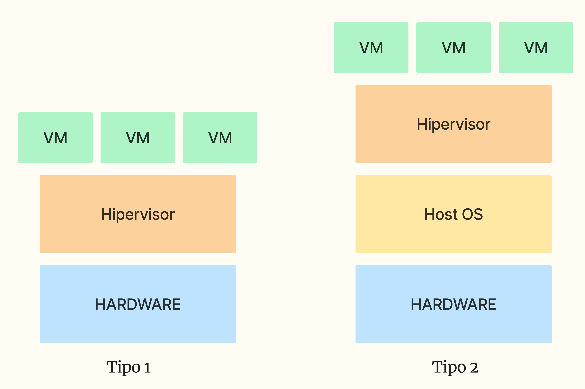
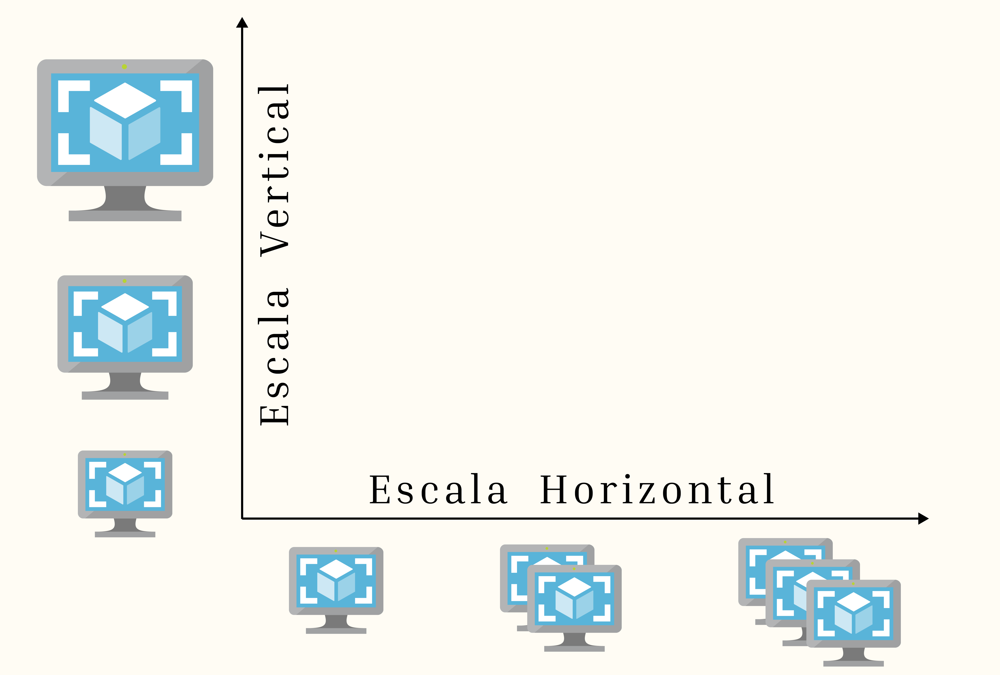
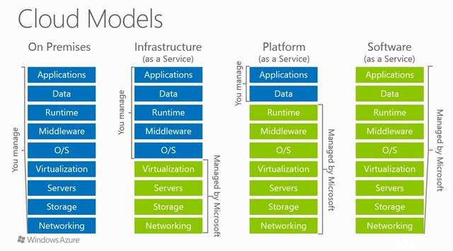

## El poder del Cloud

Los servicios del Cloud tiene 3 enfoques principales, estas son:

* **Almacenamiento**: Gardan archivos o datos.
* **Base de Datos**: Se centra en almacenar los datos relacionales.
* **Cómputo**: Son los componentes de cómputo, procesador, memoría, GPU, etc.

La ventaja del Cloud son:

* Virtualización
* Escalabilidad
* Costos
* Velocidad
* Rendimiento

### Virtualización

La virtualización es el poder obtener una o varias másquinas virtuales (VM) a partir de un sistema físico. Estos sistemas físicos puede ser brindados por un servicio de Cloud o de forma local (en nuestra propia PC).

La vistualización se logra mediante un hipervisor (hypervisor), un software que actúa como una capa entre el hardware físico y las VMs. Existen dos tipos de hipervisores:

*[sistema físico]: Son los compnentes de cómputos, procesador, memorias, etc.

1. **Hipervisor tipo 1** (bare-metal): Se instala directamente sobre el hardware físico. Es el que nos brinda los proveedores de la nube (AWS, Azure, GCP, etc.).

2. **Hipervisor tipo 2** (hosted): Se instala sobre el sistema operativo existente. Los que usan este tipo de hipervisor son los programas como VirtualBox, VMware.

<figure markdown="span">
  { width=70% }
  <figcaption>Estructura de los tipos de Hipervisores</figcaption>
</figure>

|Tipo 1|Tipo 2|
|------|------|
|Gestiona los recursos directamente desde el hardware físico, mejor rendimiento.|Compite por recursos con el sistema que lo hospeda, afecta el rendimiento.
|Menor latencia| Más fácil de usar|
|Más seguro| Ideal para pruebas y desarrollo|

### Escalabilidad

La escalabiliadad es la capacidad de un sistema para ajustar sus recursos (CPU, RAM, almacenamiento, etc.) de acuerdo a las necesidades del usuario o a la carga de trabajo. Es la posibilidad de aumentar o disminuir las máquinas virtuales o los recursos de estas.

* **Escala Vertical**: Aumentar o disminuir los recursos de las máquinas virtuales existentes (más CPU, más RAM, etc.)

* **Escala Horizontal**: Agregar o quitar máquinas virtuales (instancias) para distribuir la carga de trabajo.

<figure markdown="span">
  { width=80% }
  <figcaption>Escalabilidad vertical y horizontal</figcaption>
</figure>

### Costos

Es una de las características principales de los servicios Cloud, solo se paga por los recursos utilizados, ahorrando en los costos por mantenimiento, instalación, infraestructura local, etc. Sin embargo, esto no quita que para ciertos casos, a largo plazo la solución on-premise resulte más rentable.   

### Velocidad

Los recursos que se requiere son puesto a nuestra disposición de forma casi inmediata cuando es solicitado. No se pasa por ningúna persona externa o una cola de espera.

### Rendimiento

Tomando en cuenta lo  anterior, obtenemos una mejor gestión de los recursos, accediendo a los componentes más actuales y mejores en un instante, redes de alto rendimiento que permite la transferencia de datos más rápido, mayor seguridad en poder tener nuestros recursos en distintos data centers que nos ofrece la nube.

### Redundancia y Alta Disponibilidad

Los datos y servicios en la nube están distribuidos en múltiples ubicaciones para garantizar que si un centro de datos falla, otro puede reemplazarlo. Nos garantiza que nuestras aplicaciones o datos estén disponibles casi todo el tiempo, con mínimas interrupciones.

### Seguridad

Ofrecen protocolos de seguridad avanzados, incluyendo cifrados, autentificación multifactor, y firewalls para proteger los datos. Los proveedores de servicios Cloud, tienen equipos especializados en ciberseguridad para la protección de los datos. No solo en ciberseguridad sino también en seguridad corporativa, teniendo los centro de datos en una estricta vigilancia.

## Modelos de servicios Cloud

<figure markdown="span">
  { width=100% }
  <figcaption>Modelos de Cloud</figcaption>
</figure>

Existen tres modelos principales de servicio en la nube, cada uno con diferentes niveles de control, flexibilidad y responsabilidad para el usuario. Estos modelos son:

### IaaS (Infrastructure as a Service)

El proveedor de la nube ofrece los **recursos de la infraestructura** virtualizados (VM, almacenamiento y redes), es decir, nos ofrece las instancias de su infraestructura. Donde ellos son los responsable de su mantenimiento. Por nuestra parte, tenemos que gestionar las aplicaciones, el sistema operativo, el software.

Ejemplos de estos son: **AWS, Azure, GCP, etc.**

### PaaS (Platform as a Service)

En este modelo nosotros solo tenemos que gestionar la aplicación y los datos, por lo demás se encarga el proveedor. Es decir, el cliente solo se enfocaría en el desarrollo de la aplicación (código) y de la gestión de los datos, dejando al proveedor la gestiónd el sistema operativo, infraestructura y demás.

Ejemplos de estos son: **Power Apps, Google App Engine, Azure App Services, AWS Elastic Beanstalk.**

### SaaS (Software as a Service)

Es el modelo de servicio más accesible para el usuario general. Proporciona aplicaciones completas a través de la web que son gestionadas por el proveedor.

Ejemplo de estos son: **Notion, Gmail, Microsoft 365, SalesForce, etc.**

### FaaS (Function as a Service - Servelees)

Este modelo es conocido como **sin servidor**, el proveedor gestiona todos los aspectos de infraestructura y el usuario solo ejecuta **funciones** específicas de código. El código se ejecuta en respuesta a eventos y es escalado automáticamente. Pagas por el tiempo que se ejecuta el código

Ejemplo de estos son: **AWS Lambda, Azure Functions, Google Cloud Functions, Zapier.**

*[Servelees]: Es una forma de decirlo, ya que sí requerie de un servidor para su ejecución, pero se centra en la ejecución de funciones.