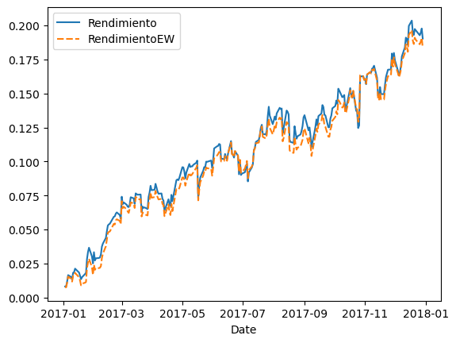

## Portafolio y Backtesting

El portafolio (cartera) es un conjunto de activos financieros de diferentes empresas que puede tener un inversionista, pueden ser:

* Acciones
* Bonos
* Fondos de inversión
* Criptomonedas
* Divisas
* Bienes raíces

El objetivo de una cartera es poder maximizar las ganancias y minimizar el riesgo. Se gestiona a través de diversificación, que consiste en invertir en varios activos para reducir la exposición a pérdidas significativas.

### Backtesting

El Backtesting es una técnica que se utiliza para probar la efectividad de una estrategia de inversión, simulando cómo habría funcionado en el pasado.

* Se define la estrategia de inversión
* Se aplican los datos históricos del mercado
* Se analizan los resultados
    * Rendimiento potencial
    * Riesgo
    * Rentabilidad ajustada al riesgo

### Pesos

En un portalio al haber varios activos financieros, es importante saber cuál es el peso de cada uno, su cálculo no es más que la proporción que tiene un activo con el total de los activos. Por ejemplo, si tiene dos acciones, uno $/. 5000.00 en `AAPL` y $/. 3000.00 `MSFT`, entonces el peso de `APPL` es 0.625 y de `MSFT` es 0.375.

Es importante saber el peso de cada activo de nuestra cartera, ya que este nos ayuda a controlar el riesgo que se está asumiendo en cada tipo de activo. Mediante los pesos podemos realizar un **Rebalanceo**; por ejemplo, si tenemos un activo con un peso de 50% a 70%, entonces debemos de mover nuestro capital de este activo, ya que en caso de haber una caída significativa en ese activo, nos perjudicaría en gran medida.

### Ejemplo

Se trabajará con los siguientes datos:

|       Date |      AAPL |      MSFT |       XOM |       JNJ |       JPM |     AMZN |        GE |       FB |         T |
|------------|-----------|-----------|-----------|-----------|-----------|----------|-----------|----------|-----------|
| 2017-01-03 |  0.002849 |  0.007081 |  0.006980 |  0.005468 |  0.010894 | 0.005068 |  0.002848 | 0.015732 |  0.011521 |
| 2017-01-04 | -0.001119 | -0.004474 | -0.011002 | -0.001640 |  0.001844 | 0.004657 |  0.000316 | 0.015660 | -0.005811 |
| 2017-01-05 |  0.005085 |  0.000000 | -0.014907 |  0.010463 | -0.009205 | 0.030732 | -0.005678 | 0.016682 | -0.002806 |
| 2017-01-06 |  0.011148 |  0.008668 | -0.000565 | -0.004792 |  0.000116 | 0.019912 |  0.002855 | 0.022707 | -0.019924 |
| 2017-01-09 |  0.009159 | -0.003183 | -0.016497 | -0.000172 |  0.000697 | 0.001168 | -0.004745 | 0.012074 | -0.012585 |

| Company Name	     | Ticker | Portfolio Weight |
|--------------------|--------|------------------|
| Apple              | AAPL	  |       12%        |
| Microsoft          | MSFT	  |       15%        |
| Exxon Mobil        | XOM    |       8%         |
| Johnson & Johnson	 | JNJ    |       5%         |
| JP Morgan          | JPM    |       9%         |
| Amazon             | AMZN   |       10%        |
| General Electric   | GE     |       11%        |
| Facebook           | FB     |       14%        |
| AT&T               | T      |       16%        |

```py title="Rendimiento Acumulado"
portafolio = portafolio.sort_values("Date")
portafolio=portafolio.set_index("Date") #(1)!

pesos_portafolio=[0.12, 0.15, 0.08, 0.05, 0.09, 0.10, 0.11, 0.14, 0.16]

RendimientoPeso = portafolio @ pesos_portafolio #(2)!

portafolio["Rendimiento"]=RendimientoPeso

RendimientoAculativo = (1+RendimientoPeso).cumprod()-1 #(3)!

RendimientoAculativo.plot()
```

1. Como se indicó en el capítulo anterior, tenemos que tener como índice a la columna fecha y que esté ordenada ascendentemente.
2. El operador `@` permite la multiplicación de matrices o arrays, entrega un solo valor por cada fila. Multiplica el peso por el rendimiento que se tuvo en el día, suma cada uno de los resultados de cada activo y nos entrega un rendimiento diario de la cartera.
3. Esto se vió en el capítulo anterior, es el cálculo del rendimiento discreto acumulativo.

<figure markdown="span">
  { width=100% }
  <figcaption>Rendimiento por Peso</figcaption>
</figure>

Qué hubiera pasado si solo hubieramos invertido en un solo activo

<figure markdown="span">
  { width=100% }
  <figcaption>Retorno Unitario</figcaption>
</figure>

!!! success "Efecto de los pesos en nuestro portafolio"
    Tener una cartera balanceada nos ayuda a disminuir el riesgo de perder todo, esto también afecta al beneficio, si tenemos un monto pequeño en una activo y este activo crece drásticamente, su impacto en nuestra cartera será poca ya que tenemos muy poco capital en este activo, pero esto también nos beneficia en caso que un activo cae drásticamente. En esta última imagen podemos ver cómo empresa como **Apple** y **Amazon** tuvieron un beneficio alrededor del 50%, pero también empresas como **General Electric** tuvieron una gran caída, si solo hubieramos invertido en esta empresa hubieramos tenido una pérdida del 42%.

### Pesos iguales como referencia

Una de las formas que podemos comparar nuestra estrategia, es compararlo con una estrategia donde la cartera tiene un pesos igual para todos los activos, veamos cómo sería.

```py hl_lines="4-9" title="Rendimiento Igual"
pesos_iguales=np.repeat(1/9, 9) #(1)!
portafolio["RendimientoEW"]=portafolio.iloc[:,:9] @ pesos_iguales #(2)!

def cumulative_returns_plot(df, columnas=None):
    df2=pd.DataFrame()
    if columnas is None:
        columnas=df.columns
    for col in columnas:
        df2[col]=(1+df[col]).cumprod()-1
    sns.lineplot(df2) #(3)!

cumulative_returns_plot(portafolio, "Rendimiento", "RendimientoEW") #(4)!
```

1. Creamos una array con 9 elementos del mismo valor (1/9), estos serían los pesos de nuestro portafolio.
2. Seleccionamos las primeras 9 columnas con todas sus filas para realizar el cálculo del nuevo rendimiento, hay que tener en cuenta que hay una nueva columna que es `Rendimiento` que se calculó en el ejemplo de arriba.
3. Creamos una función que nos permite graficar las columnas.
4. Utilizando la función que hemos creado, graficamos ambos rendimientos.


<figure markdown="span">
  { width=100% }
  <figcaption>Rendimiento con Pesos iguales</figcaption>
</figure>

### Portafolios ponderadas por capitalización de mercado

Una estrategia muy utilizada es que los pesos no lo determinemos nosotros, sino que sea proporcial a la capitalización de cada empresa. Esta misma estrategia lo utiliza el indicador **S&P 500**.

| Company Name      |  Ticker |  Market Cap ($ Billions) |
|-------------------|---------|--------------------------|
| Apple             |  AAPL   |  601.51                  |
| Microsoft         |  MSFT   |  469.25                  |
| Exxon Mobil       |  XOM    |  349.50                  | 
| Johnson & Johnson |  JNJ    |  310.48                  |
| JP Morgan         |  JPM    |  299.77                  |
| Amazon            |  AMZN   |  356.94                  |
| General Electric  |  GE     |  268.88                  |
| Facebook          |  FB     |  331.57                  |
| AT&T              |  T      |  246.09                  |

```PY title="Rendimiento Capitalización del Mercado"
market_capitalizations = np.array([601.51, 469.25, 349.5, 310.48, 299.77,
                                   356.94, 268.88, 331.57, 246.09]) #(1)!

mcap_weights = market_capitalizations/market_capitalizations.sum() #(2)!

portafolio["Rendimiento_MCap"] = portafolio.iloc[:,:9] @ mcap_weights

cumulative_returns_plot(portafolio, "Rendimiento", "RendimientoEW",
                        "Rendimiento_MCap")
```

1. Creamos nuestro array con la capitlización de mercado de cada empresa
2. Ponderamos los valores, respecto al total.

<figure markdown="span">
  { width=100% }
  <figcaption>Rendimiento Pesos por Market Capital</figcaption>
</figure>

!!! info "Resumen"
    Podemos ver que en este caso la mejor opción es la ponderación respecto a la capitalización de mercado de cada activo, una de sus desventajas de usar esta estrategia es que nuestro portafolio estará muy influenciado por las grandes empresas, estando desbalanceado. Sin embargo, es una estrategia que tiene buenos retornos y sabiendo que es utilizada por muchos indicarodores con buenos rendimientos, es una buena elección.

---

## Correlación y Covarianza

La covarianza mide si dos variables tienen el mismo sentido o dirección, es decir, si una variable aumenta, la otra también aumentará, o si uno aumenta la otra disminuirá (diferente dirección). Veamos:

* Covarianza positiva: Las variables se mueven en la misma dirección.
* Covarianza negativa: Las variables se mueven en dirección opuesta.

Sin embargo, la covarianza por sí sola no nos indica qué tan relacionada están ambas variables, aquí entra en juego la **Correlación de Pearson**, que no es más que la normalización de la **covarianza**.

* Correlación -> +1: Alta relación, se mueven en la misma dirección.
* Correlación -> 0: Sin relación.
* Correlación -> -1: Alta relación opuesta, se mueven de dirección contraria.

En el ámbito financiero, la alta correlación positiva en activos no es una buena señal para nuestro portafolio, esto es debido a que si por algun contexto político, social o económico, hay una caída en nuestro activo, al estar todas relacionadas (en el mismo sentido) entonces todos nuestros rendimientos caerá. Por tal motivo, se recomienda tener carteras diversificadas y para esto nos ayudará la correlación.

Veamos el caso del índice bursátil **S&P 500**, tiene las 500 empresas más grandes de los EE.UU respecto a su capitalización en el mercado, donde hay empresas de varios rubros (diversificado), tecnológicas, energéticas, inmobiliarias, salud, financiero, etc. Este índice es robusto y se demuestra viendo cómo ha ido durante toda su historia, teniendo un rendimiento promedio anual de $10.50\%$ y de los últimos 5 años fue de $9.4\%$.

Por otro lado, tenemos el caso del índice bursátil **NASDAQ-100**, tiene a las 100 empresas más grandes de los EEUU, respecto a su capitalización en el mercado, **solo del sector tecnológico**. Si bien la teoría nos dice que no es bueno que los activos de nuestra cartera tenga alta correlación, este índice nos muestra que aún así se puede llegar a tener un gran rendimiento. Este índice tuvo un redimiento promedio anual en toda su historia de $12\% a 13\%$ y en los últimos 5 años un $17 \%$. Quizás pensemos que considerar la correlación ya no es una buena medida para medir nuestra estrategia, pero este es un caso muy especial, ya que las empresas que componen a este índice son muy inovadoras, y están en constante desarrollo y adaptabilidad. Veamos su rendimiento desde el año 2017

|Año  | S&P 500 |   Nasdaq-100 |
|-----|---------|--------------|
|2018 | -4.4%   |   -1.0%      | 
|2019 | +31.5%  |  +38.0%      | 
|2020 | +18.4%  |  +47.6%      | 
|2021 | +26.9%  |  +26.6%      | 
|2022 | -19.4%  |  -33.1%      | 
|2023 | +22.4%  |  +55.0%      | 
|2024 | +23.3%  |  +24.8%      | 

Como se puede ver, el rendimiento del índice **NASDAQ-100** es mayor en promedio que el índice **S&P 500**, sin embargo, podemos ver que en el año 2022 tuvo una gran caída ($-33.1 \%$) que más que del S&P 500, en ese año por diversos motivo el rubro tecnológico tuvo una gran caída, por lo tanto **NASDAQ-100** se vio gravemente afectado, el **S&P 500** también sufrió este golpe ya que cerca del $28\%$ está invertida en tecnología.

Para ver la volatilidad del portafolio ($\sigma_{portafolio}$) se requiere conocer el peso y covarianza.

$$
\begin{equation}
\bbox[3pt, border: 1pt solid #00adc3]{\sigma_{portafolio} = \sqrt{w_T \cdot \sum \cdot w}}
\label{eq:volat_portafolio}
\end{equation}
$$

Donde,

* $\sigma_{portafolio}$: Volatilidad del portafolio.
* $\sum$: Matriz de covarianza de retornos.
* $w$: Matriz de pesos del portafolio ($w_T$ es la transposición de la matriz de peso).
* $\cdot$ : Operador multiplicación punto.

Esta fórmula es una representación matricial de la volatilidad de un portafolio, es una gran ventaja para operaciones computacionales.

### Ejemplo

```py title="Correlación"
df_corr = portafolio.iloc[:,:9].corr() #(1)!

sns.heatmap(df_corr, , annot=True, cmap="YlGnBu", linewidths=0.3, 
            annot_kws={"size": 8}) #(2)!

plt.xticks(rotation=90)
plt.yticks(rotation=0); #(3)!
```

1. Solo tomamos los datos de los rendimientos diarios de los activos.
2. Creamos nuestro mapa de calor
    * `#!py df_corr`: El dataframe que contiene la correlación.
    * `#!py  annot=True`: Para que se muestre los valores en los cuadros.
    * `#!py cmpa="YlGnBu"`: Paleta de color.
    * `#!py linewidths=0.3,`: Tamaño de la línea que separa a cada cuadro.
    * `#!py annot_kws={"size": 8}`: Tamaño de los números en el cuadro.
3. Rotamos el texto del ``eje X`` a 90°, y del ``eje Y`` lo colocamos a 0°.

<figure markdown="span">
  { width=100% }
  <figcaption>Correlación de Portafolio</figcaption>
</figure>

!!! note "Conclusión del mapa de calor"
    Podemos ver que tenemos activos que están relacionadas, como `APPL`, `MSFT`, `FB` en su mayoría superan el $0.50$, esto es de esperarse sabiendo que estas empresas son tecnológicas. También tenemos activos sin relación entre ellas y otras que están ligeranmente (muy poco) relacionadas en dirección opuesta.

```py title="Volatilidad"
df_cov = portafolio.iloc[:,:9].cov()
df_cov_anual = df_cov*252 # 252 días hábiles de comercio en un año

portfolio_volatility = np.sqrt(np.dot(pesos_portafolio.T,
                                      np.dot(df_cov_anual, pesos_portafolio)))
print(portfolio_volatility) # 8.93%
```

Para tener una idea de qué tan volátil es nuestra cartera, veamos el siguiente cuadro

| Volatilidad Anual (%) | Nivel de Volatilidad | Ejemplos de Activos/Portafolios                    |
|-----------------------|----------------------|----------------------------------------------------|
| 0-5%                  | Muy baja             | Bonos del Tesoro, cuentas de ahorro                |
| 5-10%                 | Baja                 | Portafolios diversificados conservadores           |
| 10-20%                | Moderada             | S&P 500, portafolios balanceados                   |
| 20-30%                | Alta                 | Nasdaq-100, acciones tecnológicas                  |
| 30% o más             | Muy alta (extrema)   | Criptomonedas, startups, portafolios especulativos |

!!! note "Conclusiones"
    De acuerdo al cuadro de volatilidad, nuestra cartera tiene una volatiliad baja, esto implicaría un menor riesgo a pérdidas, pero a su vez ganancias no tan grandes como otras. Aunque hemos visto que el rendimiento durante el año 2017 fue cerca del $20\%$, lo cuál lo hace muy buena estrategia. Faltaría realizar la prueba a nivel histórico cómo se hubiese comportado esta cartera.

---

## Portafolio de Markowitz

Imaginemos que de nuestros 9 activos hemos creado $100,000$ diferentes carteras, cada una con un peso diferente y queremos saber cuál de todas las carteras es la mejor en relación riesgo-rentabilidad.

$$
\begin{equation}
\bbox[3pt, border: 1pt solid #00adc3]{S=\frac{R_a-r_f}{\sigma_a}}
\label{eq:markowitz}
\end{equation}
$$

Donde,

* $S$: Índice de Sharpe (Sharpe Ratio).
* $R_a$: Rendimiento esperado. Es el retorno promedio de la inversión durante un periodo de tiempo, se expresa en porcentaje.
* $r_f$: Rendimiento libre de riesgo. Suelen ser los bonos del gobierno, donde su tasa de riesgo es cercano a cero.
* $\sigma_a$: Desviación estándar o volatilidad, se calcula usando retornos históricos.

Nos permite comparar el rendimiento de diferentes carteras por cada unidad de incremento de riesgo.

* $S<0$: La inversión tiene un desempeño peor que $r_f$.
* $0<S<1$: Inversión subóptima.
* $1<S<2$: Inversión buena.
* $3<S$: Inversión excelente (poco común).

### Frontera eficiente de Markowitz

Son las carteras que son las óptimas en relación rendimiento-riesgo. Todo portofolio que se encuentre en la frontera son las más eficiente, ya que no hay forma de mejorar el rendimiento sin asumir riesgo, las carteras que están debajo son ineficiente, porque con un mismo nivel de riesgo se obtiene un rendimiento menor.

Esto se obtiene después de realizar un análisis a nivel hitórico de todas las combinaciones posibles de los pesos de cada activo, más no es una predicción.

<figure markdown="span">
  { width=80% }
  <figcaption id="frontera_eficiencia">Frontera de eficiencia</figcaption>
</figure>

* **Max Shape Ratio (MSR)** Es el portafolio con el máximo índice de Shape, es el punto de tangencia entre la frontera de eficiencia y el **Capitla Market Line** (teoría de **CAPM**):

* **Global Minimum Volatility (GMV)**: Es el portafolio con la volatilidad mínima.
* **$R_f$**: Es el punto donde no hay riesgo (Risk Free)

!!! success "MSR vs GSM"
    Si bien el **MSR** es el que brinda un mayor retorno por el riesgo tomado, suele ser más inconsistente que el **GSM**, esto es debido a que cuando lo aplicamos en la actuliadad los resultados varían mucho, debido a los múltiples factores del mercado, siendo el **GSM** más "conservadora" debido al poco riesgo que se toma, pero obtiendo un buen retorno.

### Ejemplos

Hemos creado una lista random de pesos para cada activo de nuestro portafolio, se muestra el datafram `pesos_aleatorios`:

| AAPL weight | MSFT weight |  XOM weight|  JNJ weight |  JPM weight | AMZN weight | GE weight | FB weight |  T weight |   Returns | Volatility |
|-------------|-------------|------------|-------------|-------------|-------------|-----------|-----------|-----------|-----------|------------|  
| 0.000053    | 0.263110    | 0.007022   | 0.040087    | 0.000027    | 0.024316    | 0.355899  | 0.299400  | 0.010087  | 0.127453  |  0.171565  | 
| 0.042360    | 0.034922    | 0.079355   | 0.043057    | 0.001435    | 0.202032    | 0.225924  | 0.362324  | 0.008590  | 0.138614  |  0.182723  | 
| 0.207824    | 0.002132    | 0.005982   | 0.041657    | 0.007498    | 0.406642    | 0.064929  | 0.229260  | 0.034075  | 0.155952  |  0.201185  | 
| 0.096565    | 0.016775    | 0.118409   | 0.037725    | 0.020013    | 0.045195    | 0.512282  | 0.153015  | 0.000020  | 0.118787  |  0.148958  | 
| 0.131309    | 0.002733    | 0.002360   | 0.047573    | 0.050633    | 0.289410    | 0.313717  | 0.157123  | 0.005141  | 0.138304  |  0.171473  | 

```py title="Portafolio MSR"
risk_free = 0 # Asumamos que es 0
pesos_aleatorios["Sharpe"]=(pesos_aleatorios["Returns"] - risk_free) / 
                            pesos_aleatorios["Volatility"] 
                           ) #(1)!

peso_sharpe=pesos_aleatorios[
                pesos_aleatorios["Sharpe"] == 
                pesos_aleatorios["Sharpe"].max()
                ] #(2)!

msr_pesos=peso_sharpe.iloc[0, :9] #(3)!

portafolio["RendimientoMSR"]=portafolio.iloc[:, :9] @ np.array(msr_pesos) #(4)!

cumulative_returns_plot(portafolio,
                columas=["Rendimiento_MCap", "RendimientoEW", "RendimientoMSR"]
                ) #(5)!
```

1. Se calcula los índices de Sharpe, mediante la fórmula mostrada.
2. Se obtiene la fila donde se está el **índice de shape máximo**.
3. Se escoge solo los **pesos** del índice de Shape Ratio máximo (**MSR**).
4. Se realiza el cálculo del rendimiento, **producto matricial** entre los **activos del portafolio** y la matriz de los **pesos**.
5. Se grafica los tres rendimientos.

<figure markdown="span">
  { width=100% }
  <figcaption>Retorno acumulado del MSR</figcaption>
</figure>

!!! note "Conclusión"
    Se puede ver en el gráfico que aún eligiendo la cartera con mayor **Sharpe Ratio** (MSR) nuestro rendimiento no es muy bueno, incluso es menor a la media, esto es porque los datos con que se trabajó fueron datos históricos y ahora se probó con datos "actuales", demostrando que el Sharpe Ratio no es una predicción sino una medida de comparativa.

    Desafortunadamente, la cartera MSR suele ser bastante errática. Aunque la cartera haya tenido un ratio de Sharpe histórico alto, eso no garantiza que la cartera tenga un buen ratio de Sharpe en el futuro.

```py title="Portafolio GMV"
gmv_pesos=pesos_aleatorios.sort_values(
                            'Volatility', ascending=True
                            ).iloc[0, :9] #(1)!

portafolio["RendimientoGMV"] = portafolio.iloc[:, :9] @ np.array(gmv_pesos) #(2)!

cumulative_returns_plot(portafolio, 
            columns=["Rendimiento_MCap", "RendimientoEW", 
            "RendimientoMSR", "RendimientoGMV"])
```

1. Se ordena respecto a la columna `Volatility` y tomamos los pesos la primera fila, esta es la que tiene la volatilidad más baja de todas.
2. Se calcula el rendimiento respecto a los pesos del **GMV**.

<figure markdown="span">
  { width=100% }
  <figcaption>Retorno acumulado del GMV</figcaption>
</figure>

!!! note "Conclusión"
    Podemos ver cómo la gráfica de la cartera **GMV** si bien tiene un retorno menor al **MSR**, se puede rescatar que no fluctua tan drásticamente como su contraparte, obtieniendo un rendimiento alrededor del $10\%$ y sin correr mucho riesgo. Aún así, sigue siendo menor a una estrategia simple como es el `RendimientoEW` (todos los pesos son iguales).